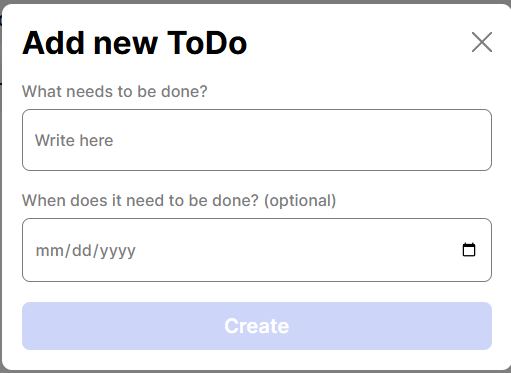
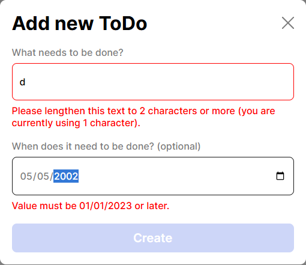

# Simple Todo App

Give a brief description of the project here. Feel free to give it a different name.

Project 7 is a form that allows you to enter a list of tasks that you can add and delete or check them off. making it easier to keep track of your current day to day tasks.
## Functionality

Give a more detailed explanation of the project and its functionality.

A responsive form that allows you to add items to a list to be completed. This design adds the following: checkbox, name, date to allow you to better prioritize. Everytime you add a new item to the list it comes with a unique id so no duplicates can happen. Once you have succefully entered accurate info and hit "create" the form will close and reset, so the next time you open to add a second there is no need to delete any info.

## Technology

Give a description of the technologies and techniques used. Pictures, GIFs, or screenshots that detail the project features are recommended.

- HTML
- CSS
-Responsive design
-flexbox Layout
- List-style-type: so we can get rid of the bullet points that it auto-generates.
- Gap: Was used between the rows to be able to achieve the right amount of space to avoid using margin in some areas. add to the children and not the parent. 
- Display-Block: was used on the parent to be able to fill the entire width of the containg element. Also to allow easier manipulation of tthe width and height.

-Showing the submit button is disabled when no information is entered.

-If not all the information is entered you will be greeted with the messages as shown in the picture.
## Deployment

This project is deployed on GitHub Pages:

- [Github link](https://github.com/CarrascoEdgar/se_project_todo-app-main.git)
